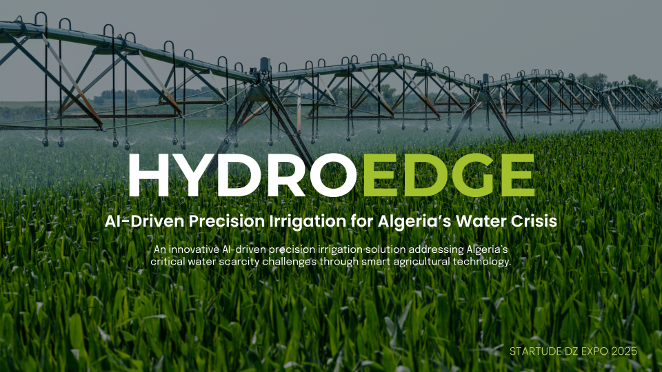

# HydroEdge AI: A Digital Twin for Smart Irrigation



This repository contains a full-stack software simulation of **HydroEdge**, an AI-driven precision irrigation system concept designed to address critical water scarcity challenges in agriculture.

---

## The HydroEdge Concept

The core idea behind HydroEdge is to create an accessible, low-cost smart irrigation system tailored for smallholder farmers in water-scarce regions like Algeria. The system is designed to optimize water usage by making intelligent, real-time decisions based on environmental data.

*   **The Problem:** Traditional irrigation methods are often inefficient, leading to significant water waste. This is unsustainable in regions facing severe water stress and threatens food security.
*   **The Solution:** HydroEdge integrates a network of low-cost IoT sensors (for soil moisture, temperature, etc.) with a centralized AI engine. This engine analyzes incoming data, predicts future crop water needs, and automatically controls irrigation valves to deliver precisely the right amount of water at the right time.

---

## About This Repository: A Digital Twin

Since physical IoT hardware is not part of this project, this repository implements a **"Digital Twin"**—a complete software simulation of the HydroEdge system. It demonstrates the entire data-to-decision pipeline in a dynamic and interactive way.

The simulation showcases:
1.  Realistic, time-series sensor data generation.
2.  A machine learning model trained on this data to make intelligent irrigation decisions.
3.  A backend API that runs the simulation and serves the AI model.
4.  A live, real-time frontend dashboard to visualize the system in action.

---

## Key Features

### AI & Backend

*   **Time-Series Data Simulation:** A robust Python script generates a 5-year hourly dataset simulating soil moisture, temperature, and evaporation cycles.
*   **Feature Engineering:** A `moisture_change_last_hour` feature was engineered to provide the model with crucial trend information, dramatically improving its predictive accuracy.
*   **Intelligent SVM Model:** A Support Vector Machine (SVM) model was trained using `scikit-learn` on the simulated data. It is optimized with `class_weight='balanced'` to handle the severe class imbalance inherent in irrigation events.
*   **Flask API:** A lightweight Flask server loads the trained model and exposes API endpoints to run and control the simulation, acting as the brain of the digital twin.

### Frontend Dashboard

*   **Real-Time Data Visualization:** The dashboard features a live-updating line chart (built with **Chart.js**) that visualizes soil moisture and temperature over the 24-hour simulation cycle.
*   **Dynamic Stat Cards:** Key metrics like the current hour, temperature, and the AI's real-time decision are displayed in clear, easy-to-read cards.
*   **Interactive Simulation Controls:** The user can start, stop, and reset the 24-hour simulation with a simple and intuitive control panel.
*   **Responsive UI:** The interface is built with **React, Vite, and Tailwind CSS**, ensuring a seamless experience on all devices.

---

## Tech Stack

**Frontend:**
*   React.js
*   Vite
*   Tailwind CSS
*   Chart.js & react-chartjs-2

**Backend:**
*   Python
*   Flask
*   scikit-learn
*   Pandas & NumPy

---

## Running The Project Locally

To get a local copy up and running, follow these simple steps.

### Prerequisites

*   Node.js (v18 or later)
*   Python (v3.9 or later)
*   npm & pip

### Installation & Setup

1.  **Clone the repository:**
    ```sh
    git clone https://github.com/your-github-username/HydroEdge-AI.git
    cd HydroEdge-AI
    ```

2.  **Setup the Backend:**
    ```sh
    cd backend
    python3 -m venv venv
    source venv/bin/activate
    pip install -r requirements.txt 
    ```
    *(Note: You will need to create a `requirements.txt` file. See below.)*

3.  **Setup the Frontend:**
    ```sh
    cd ../frontend 
    npm install
    ```

### Running the Application

1.  **Start the Backend Server:**
    *   Navigate to the `backend` directory and ensure your virtual environment is active.
    *   Run the Flask server:
        ```sh
        python3 app.py
        ```
    *   The backend will be running on `http://localhost:5000`.

2.  **Start the Frontend Application:**
    *   In a **new terminal window**, navigate to the `frontend` directory.
    *   Run the React development server:
        ```sh
        npm run dev
        ```
    *   Open [http://localhost:5173](http://localhost:5173) to view the application.

---

## Author

**Anouar Adel**
*   **GitHub:** [@AnouarAdel](https://github.com/AnouarAdel)
*   **LinkedIn:** [Anouar Adel](https://www.linkedin.com/in/anouar-adel-0a4928323/)
*   **Email:** [adelanouar60@gmail.com](mailto:adelanouar60@gmail.com)

---

## License

This project is licensed under the MIT License. See the [LICENSE](LICENSE) file for details.
